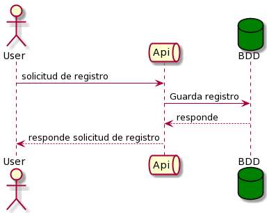
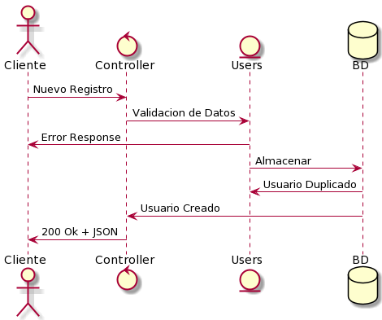

# Ejercicio propuesto
Proyecto para creacion de usuarios.

## Diagramas 



# Pasos para probar:

## Requisitos
* Java 8


## Pasos a seguir:
* Clonar este repositorio.
* Otorgar permisos de ejecución a a gradlew con sudo chmod +x gradlew.
* Levantar el proyecto con: ./gradlew bootRun
* Enviar petición POST a http://localhost:8080/authorization/register con el siguiente payload de ejemplo:

```
{
    "name": "Juan Rodriguez",
    "email": "juan@rodriguez.org",
    "password": "hunter2",
    "phones": [
        {
            "number": "1234567",
            "citycode": "1",
            "contrycode": "57"
        }
    ]
}
```
